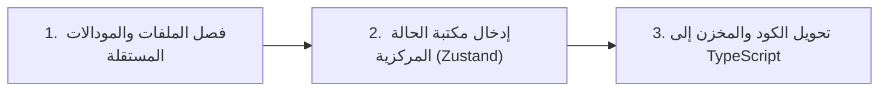

# خطة ودليل إعادة الهيكلة الشاملة للمشروع (Refactoring Roadmap)

---

## 1. التقييم المعماري: هل تفكيرك سليم؟

**نعم، كلامك صحيح 100% وجاء في التوقيت المثالي تماماً!**

المشروع الحالي قطع شوطاً كبيراً وأصبح غنياً بالميزات الحقيقية، لكنه وصل إلى مرحلة معمارية تُعرف برمجياً بـ **"Monolithic Frontend Components"** (المكونات الضخمة المتشابكة). الكود الحالي يعمل بشكل جيد، لكن الاستمرار في إضافة ميزات جديدة بدون هذه الهيكلة سيجعل التطوير أبطأ وأكثر عرضة للأخطاء غير المتوقعة.

### أرقام وواقع الكود الحالي في المشروع بالأرقام:

| الملف الحالي                              | عدد الأسطر    | عدد الـ `useState`    | التحدي الرئيسي                                                                        |
| :---------------------------------------- | :------------ | :-------------------- | :------------------------------------------------------------------------------------ |
| `app/battle/page.jsx`                     | **2,223 سطر** | **26 State** + 6 Refs | تجمع بين الاتصال بالسيرفر، الصوتيات، إدارة المؤقت، استقبال Realtime، ومعالجة الضربات. |
| `components/battle/RefereeGameScreen.jsx` | **1,777 سطر** | **21 State**          | شبكة الأسئلة، إجابة السؤال، شاشة الباركود، 5 نوافذ منبثقة (Modals)، وأزرار التحكم.    |
| `components/admin/QuestionsTab.jsx`       | **1,521 سطر** | 12 State              | جداول الأسئلة، الفلاتر، التعديل المباشر، الإحصائيات، والعمليات الجماعية.              |
| `components/battle/CombatShared.jsx`      | **827 سطر**   | 8 State               | مكونات مشتركة، مشغلات وسائط، نتائج المعركة، وشاشات الانتظار.                          |
| `app/admin/page.jsx`                      | **763 سطر**   | 15 State              | إدارة التبويبات والمودالات والبيانات ومصادقة الأدمن.                                  |

---

## 2. هل يمكن أن يضر هذا التعديل المشروع في شيء؟ (تحليل المخاطر)

### متى يضر المشروع؟

يضر المشروع في حالة واحدة فقط: **إذا تم التحويل دفعة واحدة وبشكل عشوائي (Big-Bang Refactor)**.
إذا قمت بمحاولة كتابة TypeScript لكل ملف 2200 سطر دفعة واحدة، أو استبدال كافة الحالات في كل الشاشات بلحظة واحدة، فستنشأ أخطاء خفية (Regressions) في:

1. تزامن قنوات **Supabase Realtime** بين شاشة الحكم واللاعبين.
2. تزامن المؤقت الزمني (Timer State) أثناء الإيقاف المؤقت واستئناف الأسئلة.
3. معالجة العمليات الحساسة مثل تنفيذ الضربات ومنع تكرار ضرب نفس المربع.

### متى يكون آمناً ومفيداً 100%؟

إذا تم باتباع **"التحويل التدريجي الذكي" (Incremental Migration)**:

- المشروع يدعم مسبقاً ملف `tsconfig.json` مع خيار `"allowJs": true`، مما يعني أن TypeScript وجافاسكريبت يمكنهما العمل معاً جنباً إلى جنب في نفس اللحظة بدون أدنى مشكلة.
- لن تتوقف اللعبة ولن يتعطل السيرفر؛ سنقوم بتحويل ونقل أجزاء مستقلة ومختبرة جزءاً تلو الآخر.

---

## 3. أيّهما أولاً؟ ولماذا؟ (ترتيب التنفيذ الاحترافي)

> [!IMPORTANT]
> **الخطأ الشائع:** البدء بكتابة TypeScript على ملف به 2200 سطر ومليء بالـ Props المتشابكة.
> **النتيجة:** ستضيع أياماً في اختراع Interfaces مؤقتة لـ 26 state و 15 دالة، ثم عندما تقوم بفصل الملفات أو إدخال مكتبة الحالة، ستضطر لحذف كل تلك الـ Types وإعادة كتابتها من الصفر!

### الترتيب العلمي الصحيح:



1. **الخطوة الأولى: فصل المكونات الفرعية المستقلة (Component Extraction):**
   - استخراج النوافذ المنبثقة (Modals) مثل: نافذة الرادار، نافذة الدعم، نافذة إجابة السؤال، والمحرك الصوتي في ملفات منفصلة.
   - هذا يقلل حجم الملفات من 2200 سطر إلى ملفات نظيفة حجم كل منها 100 - 250 سطر فقط.
2. **الخطوة الثانية: تخزين الحالة المركزية (State Management):**
   - نقل الـ 26 State المشتركة والـ Realtime Callbacks من `page.jsx` إلى Store مركزي ومستقر.
   - القضاء التام على تمرير المتغيرات عبر 5 طبقات (Prop Drilling).
3. **الخطوة الثالثة: كتابة الـ TypeScript النظيف:**
   - كتابة Types نقية وواضحة لقاعدة البيانات (`Database Types`)، والغرفة (`RoomState`)، وأحداث القتال (`CombatEvent`).
   - تحويل الملفات المفصولة من `.jsx` إلى `.tsx` بسلاسة، حيث ستتعرف تلقائياً على أنواع البيانات من الـ Store بدون أي تعقيد.

---

## 4. أفضل مكتبة لتخزين وإدارة الحالة: لماذا (Zustand)؟

| المقارنة                          | Zustand (الموصى بها بشدة)                                                                     | Redux Toolkit                                        | React Context API                                                  |
| :-------------------------------- | :-------------------------------------------------------------------------------------------- | :--------------------------------------------------- | :----------------------------------------------------------------- |
| **الحجم والسرعة**                 | فائقة الصغر (< 2KB)، سريعة جداً.                                                              | ثقيلة نسبياً (~30KB).                                | مدمجة برياكت، ولكنها تعيد رسم الشاشة بالكامل عند أي تحديث.         |
| **سهولة الكود**                   | خطاف واحد مباشر `useBattleStore(state => state.room)`.                                        | معقدة، تحتاج Actions, Reducers, Slices, Dispatchers. | تحتاج Providers متداخلة وتمرير معقد.                               |
| **منع التكرار (Re-renders)**      | **انتقائي دقيق (Atomic Selectors)**؛ المكون لا يُعاد رسمه إلا إذا تغير الحقل الذي يراقبه فقط. | جيد ولكن يحتاج إعدادات إضافية.                       | **سيء جداً**؛ تغيير ثانية واحدة في المؤقت يعيد رسم كل شاشة اللعبة! |
| **التوافق مع Next.js و React 19** | توافق كامل 100% وبدون مشاكل مع SSR و Hydration.                                               | يحتاج إعدادات خاصة بالـ SSR.                         | توافق عادي.                                                        |

**القرار:** استخدام **Zustand**، فهي المعيار القياسي لتطبيقات Next.js والألعاب التفاعلية السريعة.

---

## 5. خطة تفكيك الملفات الكبيرة (Monolith Decomposition Map)

### أولاً: تفكيك شاشة المعركة `app/battle/page.jsx` (2,223 سطر ⬅ 6 ملفات):

1. `stores/useBattleStore.ts`:
   - إدارة حالة الغرفة، الفرق، الأسئلة، وأحداث القتال.
   - استقبال أحداث Supabase Realtime مركزياً.
2. `hooks/useBattleAudio.ts`:
   - عزل كامل لمحرك الصوت التخليقي (Web Audio API) والنغمات (`playGameSound`, `hit`, `miss`, `blocked`).
3. `components/battle/modals/StrikeModal.tsx`:
   - نافذة ضرب الأسطول ولوحة الـ 36 مربع وخيار إلغاء الضربة.
4. `components/battle/modals/RadarModal.tsx`:
   - نافذة الرادار وكشف المربعات.
5. `components/battle/modals/GameSupportModal.tsx`:
   - نافذة الدعم الفني ورفع الصور (التي بنيناها مؤخراً).
6. `app/battle/page.tsx`:
   - تصبح صفحة المعركة الرئيسية مجرد صفحة ذكية خفيفة لا تتعدى **200 إلى 300 سطر** فقط تقوم بتجميع هذه المكونات!

### ثانياً: تفكيك شاشة الحكم `RefereeGameScreen.jsx` (1,777 سطر ⬅ 4 ملفات):

1. `components/battle/referee/RefereeHeader.tsx`: شريط الحكم العلوي وأزرار إنهاء اللعبة.
2. `components/battle/referee/RefereeQuestionView.tsx`: عرض السؤال وقواعد ولا كلمة وإجابة السؤال والباركود.
3. `components/battle/referee/RefereeBoardGrid.tsx`: شبكة المربعات الـ 36 التفاعلية.
4. `components/battle/referee/GameBottomFooter.tsx`: فوتر لوحة الفرق ووسائل المساعدة وزر الدعم الفني.

### ثالثاً: تفكيك صفحة الأسئلة في الإدارة `QuestionsTab.jsx` (1,521 سطر ⬅ 3 ملفات):

1. `components/admin/questions/QuestionsFilterBar.tsx`: فلاتر التصنيف، الصعوبة، والبحث.
2. `components/admin/questions/QuestionsTable.tsx`: جدول الأسئلة مع التعديل السريع.
3. `components/admin/questions/QuestionsBulkActions.tsx`: شريط العمليات الجماعية (تفعيل، تعطيل، حذف).

---

## 6. خطة التنفيذ خطوة بخطوة وبأمان تام (Detailed Execution Plan)

### المرحلة الأولى: التأسيس، الأنواع المشتركة، وعزل المودالات (Zero-Risk Component Extraction)
1. **تثبيت مكتبة Zustand**:
   - تثبيت حزمة `zustand` لإدارة الحالة.
2. **إنشاء مجلد العقود والأنواع المشتركة `types/`**:
   - `types/game.ts`: تعريف `GameRoom`, `Team`, `Question`, `CombatEvent`, `ToolType`, `StrikeResult`.
   - `types/admin.ts`: تعريف `CategoryGroup`, `Category`, `SupportMessage`.
3. **عزل محرك الصوت المستقل**:
   - `hooks/useBattleAudio.js`: نقل Web Audio API وتوليد النغمات (`playGameSound`) مع حماية Throttling من التكرار.
4. **استخراج المودالات المنبثقة المستقلة من `RefereeGameScreen.jsx`**:
   - `components/battle/modals/StrikeBoardModal.jsx`: لوحة ضرب الأسطول 36 مربع وزر إلغاء الضربة.
   - `components/battle/modals/RadarScanModal.jsx`: لوحة مسح الرادار.
   - `components/battle/modals/GameSupportModal.jsx`: فورم الدعم الفني ورفع الصور.
   - `components/battle/modals/ConfirmActionModal.jsx`: تأكيد إنهاء اللعبة أو الخروج.
   > **النتيجة بعد المرحلة 1:** ينخفض حجم `RefereeGameScreen.jsx` فوراً بمقدار ~700 سطر دون المساس بنظام اللعبة!

---

### المرحلة الثانية: بناء مخزن المعركة `useBattleStore` وتبسيط صفحة المعركة (Battle State Store)
1. **بناء `stores/useBattleStore.js`**:
   - **البيانات المركزية**: `room`, `teams`, `questions`, `combatEvents`, `activeQuestion`, `activeAnswer`, `latestCombatEvent`, `radarRevealsByTeam`, `timerState`.
   - **العمليات المركزية (Actions)**: `initBattle()`, `executeStrike()`, `cancelStrike()`, `useTool()`, `grantPoints()`, `grantExtraStrike()`, `pauseTimer()`, `resumeTimer()`, `resetTimer()`, `endGame()`.
   - **الاشتراك اللحظي (Supabase Realtime Channel)**: يتم ربطه لمرة واحدة داخل الـ Store أو Hook مركزي لمنع اشتراكات Realtime المكررة.
2. **تبسيط `app/battle/page.jsx`**:
   - التخلص من الـ 26 `useState` واستبدالها بـ Atomic Selectors.
   - تقليص حجم الملف من **2,223 سطر إلى أقل من 300 سطر**.

---

### المرحلة الثالثة: تفكيك واجهة الحكم `RefereeGameScreen.jsx` إلى مكونات متخصصة
1. `components/battle/referee/RefereeHeader.jsx`: الشريط العلوي، شعار اللعبة، وأزرار إنهاء اللعبة والعودة للشبكة.
2. `components/battle/referee/RefereeQuestionView.jsx`: شاشة السؤال وقواعد ولا كلمة والمؤقت الدائري والباركود والإجابة.
3. `components/battle/referee/RefereeBoardGrid.jsx`: شبكة المربعات الـ 36 التفاعلية واختيار الأسئلة.
4. `components/battle/referee/TeamControls.jsx`: نقاط الفرق وشريط الضربات وأزرار المساعدات.
5. `components/battle/referee/GameBottomFooter.jsx`: فوتر سطح المكتب والموبايل مع الحفاظ الكامل على زر الدعم الفني.
> **النتيجة بعد المرحلة 3:** يصبح ملف `RefereeGameScreen.jsx` صفحة منسقة أنيقة لا تتجاوز **180 سطر**.

---

### المرحلة الرابعة: تحسين لوحة التحكم وتفكيك `QuestionsTab.jsx`
1. إنشاء `stores/useAdminStore.js`: إدارة الفئات، التصنيفات، الأسئلة، وعدّاد رسائل الدعم غير المقروءة.
2. تفكيك `components/admin/QuestionsTab.jsx` (من 1,521 سطر إلى 3 أجزاء):
   - `components/admin/questions/QuestionsFilterBar.jsx`: فلاتر التصنيف والصعوبة والبحث.
   - `components/admin/questions/QuestionsTable.jsx`: جدول الأسئلة مع التعديل الفوري.
   - `components/admin/questions/QuestionsBulkBar.jsx`: شريط العمليات الجماعية.

---

### المرحلة الخامسة: الانتقال الشامل إلى TypeScript
1. تحويل ملفات الـ Stores والعقود إلى `.ts` (`stores/useBattleStore.ts`, `stores/useAdminStore.ts`, `hooks/useBattleAudio.ts`).
2. تحويل المكونات المعيارية المفصولة تدريجياً إلى `.tsx` (المودالات ⬅ المكونات الفرعية ⬅ الصفحات).
3. فحص البناء والأمان البرمجي الكامل عبر `npx tsc --noEmit`.

---

## 7. مقارنة عملية قبل وبعد (Before vs After Code)

### قبل (الكود الحالي في `app/battle/page.jsx`):
```jsx
// 26 حالة منفصلة ومئات الأسطر لتمرير الـ Props يدوياً
const [room, setRoom] = useState(null);
const [teams, setTeams] = useState([]);
const [combatEvents, setCombatEvents] = useState([]);
const [activeAnswer, setActiveAnswer] = useState(null);
// ... 22 حالة أخرى
<RefereeGameScreen
  room={room}
  team1={team1}
  team2={team2}
  isBusy={isActionBusy}
  onGrantPoints={handleGrantPoints}
  onOpenRadar={setRadarModalTeam}
  onOpenStrike={setStrikeModalTeam}
  onOpenSupport={() => setSupportModalOpen(true)}
  // ... 15 دالة أخرى!
/>;
```

### بعد إعادة الهيكلة (Zustand + Clean Architecture):
```tsx
// داخل useBattleStore.ts
export const useBattleStore = create<BattleState>((set, get) => ({
  room: null,
  teams: [],
  combatEvents: [],
  executeStrike: async (teamIndex, cellIndex) => {
    // كود الضربة والتحديث التفاؤلي والسيرفر مركزياً
  },
}));

// داخل مكون RefereeGameScreen.tsx الصغير والنظيف (~180 سطر فقط!)
export function RefereeGameScreen() {
  const room = useBattleStore((s) => s.room);
  const step = useBattleStore((s) => s.step);

  return (
    <div className="game-screen">
      <RefereeHeader />
      {step === "grid" ? <RefereeBoardGrid /> : <RefereeQuestionView />}
      <GameBottomFooter />
    </div>
  );
}
```

---

## 8. خطة التحقق والضمان لمنع أي أخطاء في نظام اللعبة (Safety & Verification)

لضمان عدم حدوث أي خلل في دائرة عمل اللعبة (Game Workflow):
1. **اختبار دورة المعركة بالكامل في كل خطوة**:
   - نشر الفرق وتوزيع العتاد (Deployment).
   - اختيار الأسئلة وظهور المؤقت 60 ثانية وقواعد "ولا كلمة" والباركود.
   - تنفيذ الضربات والتأكد من إطلاق الصوت **مرة واحدة فقط** وظهور النتيجة (Hit / Miss / Mine / Blocked).
   - تجربة زر إلغاء الضربة وتصفير الضربات عند الخطأ.
   - تجربة كشف الرادار، الدرع، والضربة المزدوجة.
   - تأكيد تزامن Supabase Realtime الفوري بين شاشة الحكم وشاشات الفرق.
   - إنهاء اللعبة وظهور شاشة الفائز والاحتفال.
2. **فحص الـ Lint والـ Build المستمر**:
   - التأكد من عدم وجود أي خطأ في الكونسول أو تكسير في الـ SSR.
3. **التنفيذ المرحلي المنضبط**:
   - لا يتم الانتقال من مرحلة إلى المرحلة التالية إلا بعد التأكد التام من عمل كل عناصر المرحلة السابقة 100%.

